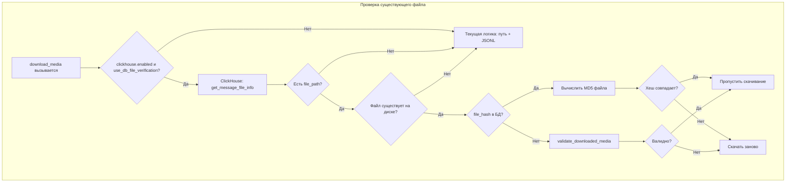

# План: БД как верификатор файлов + команда удаления чатов из архива

## Контекст (прочитанные правила)

- `.cursor/rules.md`
- `.cursor/architecture.md`
- Текущая логика: `_check_existing_file` → проверка по пути + поиск в JSONL по имени/размеру; `validate_downloaded_media` — размер + magic bytes. JSONL-поиск медленный на больших чатах.
- ClickHouse уже хранит: `messages` (file_path, file_size), `file_downloads` (status, file_path). Хеша нет.

---

## Часть 1: База данных как верификатор скачанных файлов

### 1.1 Схема: колонка хеша в БД

Добавить в ClickHouse колонку для хеша целостности файла:

- **Таблица `messages**`: добавить `file_hash String` (MD5 или SHA256).
- **Таблица `file_downloads**`: добавить `file_hash String`.

**Выбор хеша:** MD5 уже используется в `file_management._get_file_hash()` для дубликатов. Для целостности MD5 достаточно; SHA256 — сильнее, но медленнее. Рекомендация: **MD5** (быстрее, консистентность с дубликатами).

Миграция: `ALTER TABLE messages ADD COLUMN IF NOT EXISTS file_hash String DEFAULT ''` (аналогично `file_downloads`). Обратная совместимость: старые записи с пустым хешем — при проверке считать "нет хеша" и выполнять полную валидацию (текущее поведение).

### 1.2 Логика проверки «уже скачано» с использованием БД

Текущий flow в `_check_existing_file`:

1. Проверить файл по ожидаемому пути (размер + сигнатура).
2. Иначе искать в архиве (JSONL) по имени + размеру.

**Новый flow при `clickhouse.enabled`:**

1. Запросить в ClickHouse по `(chat_id, message_id)`: `file_path`, `file_size`, `file_hash`.
2. Если есть запись с non-empty `file_path`:
  - Файл существует на диске?
  - Если `file_hash` заполнен: сравнить хеш диска с хешем из БД (O(1) вместо magic bytes).
  - Если `file_hash` пуст: fallback на `validate_downloaded_media`.
  - При успехе → вернуть путь (пропуск скачивания).
3. Если в БД нет или проверка не прошла — fallback на текущую логику (путь + поиск в JSONL).

**Преимущества:**

- Быстрый пропуск уже скачанных: один SQL-запрос вместо чтения всего JSONL.
- 100% целостность: хеш гарантирует, что файл не повреждён.
- Резкое ускорение для больших чатов: O(1) по БД вместо O(n) по JSONL.

### 1.3 Сохранение хеша при записи

- При успешной загрузке и записи в ClickHouse (`save_message`, `save_file_download`) вычислять MD5 и писать в `file_hash`.
- В [core/downloader.py](core/downloader.py) в местах вызова `clickhouse_db.save_message` и `save_file_download` передавать `file_hash` (из `_get_file_hash` из `utils/file_management.py`).

### 1.4 Методы в ClickHouseMetadataDB

- `get_message_file_info(chat_id, message_id) -> Optional[Tuple[file_path, file_size, file_hash]]`
- Вставка: расширить `_insert_messages` и `save_file_download` для колонки `file_hash`.

### 1.5 Конфиг

- `download_settings.use_db_file_verification: true` — использовать БД для верификации (при `clickhouse.enabled`).
- `download_settings.validate_downloads` — по-прежнему управляет полной валидацией, когда хеша в БД нет.

---

## Часть 2: Команда удаления чатов из архива

### 2.1 Назначение

Позволяет полностью удалить чат из архива и подготовить его к повторной загрузке и парсингу.

### 2.2 Что удаляется при «удалении чата»


| Объект              | Действие                                                           |
| ------------------- | ------------------------------------------------------------------ |
| config.yaml (chats) | Сброс `last_read_message_id=0`, `ids_to_retry=[]` для чата         |
| JSONL               | Удалить `chat_{chat_id}.jsonl`                                     |
| HTML                | Удалить `chat_{chat_id}.html`                                      |
| index.html          | Регенерировать (без этого чата)                                    |
| ClickHouse          | Удалить строки из `messages`, `chats`, `file_downloads` по chat_id |
| Медиафайлы          | По умолчанию **не трогать** (опция `--delete-media` для удаления)  |


### 2.3 Интерфейс команды

Вариант A: отдельный скрипт `remove_chat_from_archive.py` (по аналогии с `cleanup_orphaned_files.py`, `export_chat.py`).

Вариант B: subcommands в `media_downloader.py` (например `python media_downloader.py archive remove --chat-id X` или `--all`).

Рекомендация: **отдельный скрипт** `remove_chat_from_archive.py` — проще, изолирован, без нагрузки на основной загрузчик.

```text
remove_chat_from_archive.py [--config PATH] (--chat-id ID | --all) [--delete-media] [--dry-run]
```

- `--chat-id ID` — удалить один чат
- `--all` — удалить все чаты из архива (по списку в config + по наличию JSONL/CH)
- `--delete-media` — удалять также медиафайлы, упомянутые в архиве (опционально, по умолчанию нет)
- `--dry-run` — только показать, что будет удалено, без изменений

### 2.4 Реализация

1. **Файл:** `remove_chat_from_archive.py`
2. Чтение config (base_directory, history_path, clickhouse).
3. Определение списка chat_id: из `--chat-id` или `--all` (config.chats + JSONL файлы + ClickHouse get_chats_manifest).
4. Для каждого chat_id:
  - Обновить config: сбросить last_read_message_id, ids_to_retry
  - Удалить JSONL, HTML
  - Удалить из ClickHouse: `ALTER TABLE messages DELETE WHERE chat_id = X` (или `DELETE FROM` в зависимости от движка — в ClickHouse это `ALTER TABLE ... DELETE`)
  - При `--delete-media`: собрать file_path из JSONL/CH и удалить файлы (с проверкой base_directory)
5. Регенерация index.html (вызвать логику из history/html_formatter или history_manager).
6. Сохранение config.

### 2.5 ClickHouse DELETE

ClickHouse: `ALTER TABLE messages DELETE WHERE chat_id = %(chat_id)s` (асинхронная мутация). Аналогично для `file_downloads`, `chats` (если есть отдельная таблица chats — там тоже удаление по chat_id).

---

## Порядок реализации

1. **Схема БД**: добавить `file_hash` в `messages` и `file_downloads`; миграция в `_init_db` или отдельный скрипт миграции.
2. **ClickHouseMetadataDB**: метод `get_message_file_info`; обновить `_insert_messages` и `save_file_download` для записи хеша.
3. **core/downloader.py**: в `download_media`/`_check_existing_file` при `clickhouse.enabled` и `use_db_file_verification` — сначала запрос в CH; при наличии хеша — проверка хеша вместо полной validate_downloaded_media.
4. **Сохранение хеша**: при успешной загрузке вычислять MD5 и передавать в save_message/save_file_download.
5. **remove_chat_from_archive.py**: скрипт с argparse; логика удаления config/JSONL/HTML/CH; опция --delete-media; dry-run.
6. **config.yaml.example**: новые опции `use_db_file_verification`, документация для remove_chat_from_archive.
7. **CHANGELOG.md**: описать изменения.

---

## Диаграмма: проверка «уже скачано» с БД




---

## Риски и совместимость

- **Миграция CH**: `ADD COLUMN IF NOT EXISTS` — старые инсталляции получат колонку при первом запуске.
- **Без ClickHouse**: при `clickhouse.enabled=false` поведение не меняется.
- **remove_chat_from_archive**: при `--all` — осторожность: подтверждение (например, `Confirm.ask`) или явный флаг `--yes` для неинтерактивного режима.

