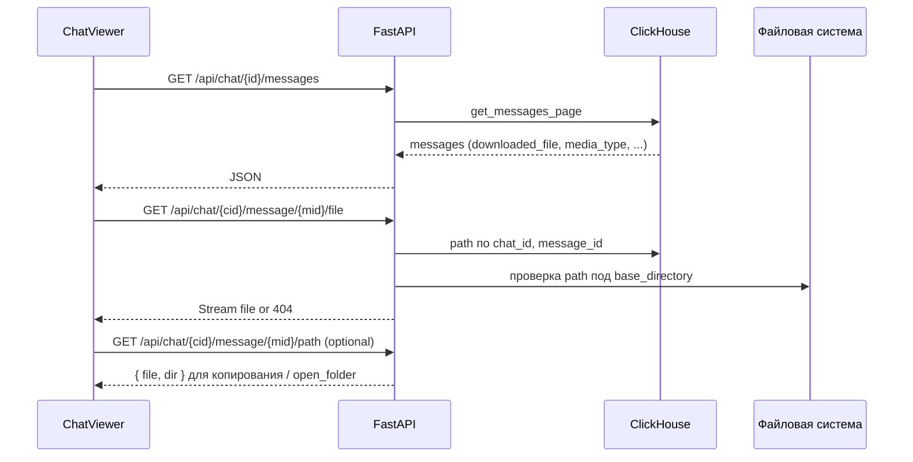

# План: просмотр архива чатов уровня [web.telegram.ru](http://web.telegram.ru)

## Текущее состояние

- **ChatViewer** ([web/ui/src/App.jsx](web/ui/src/App.jsx)): список сообщений из `GET /api/chat/{chat_id}/messages` с текстом, датой и одной строкой «Media + тип + размер». Поле `downloaded_file` с бэкенда не используется.
- **API** ([web/app.py](web/app.py), [utils/clickhouse_db.py](utils/clickhouse_db.py)): `get_messages_page` возвращает `id`, `date`, `text`, `has_media`, `media_type`, `file_size`, `downloaded_file` (путь на сервере). Имя файла не отдаётся (можно брать `basename(downloaded_file)`).
- Файлы лежат на сервере; в браузере нельзя использовать `file://`. Нужен endpoint для отдачи файла по `chat_id` + `message_id`.

## Архитектура изменений

## 1. Backend

### 1.1 Раздача файла по сообщению

- **Файл:** [web/app.py](web/app.py).
- **Endpoint:** `GET /api/chat/{chat_id}/message/{message_id}/file`.
- Логика: из конфига взять `download_settings.base_directory`; из ClickHouse по `(chat_id, message_id)` получить `file_path`; проверить, что итоговый путь реально лежит внутри `base_directory` (нормализация и `os.path.commonpath` / проверка префикса), и что файл существует; вернуть `FileResponse(path, media_type=...)` или `StreamingResponse` с корректным `Content-Disposition` (имя файла = basename). При ошибке (нет в БД, путь снаружи base, файла нет) — 404.

### 1.2 Путь к файлу/папке для «открытия папки»

- **Endpoint:** `GET /api/chat/{chat_id}/message/{message_id}/path`.
- Ответ: `{"file": "/abs/path/to/file", "dir": "/abs/path/to/parent"}` (или пустые строки, если файла нет). Используется для отображения в UI и копирования в буфер.

### 1.3 Опциональное «открыть в проводнике»

- **Endpoint:** `POST /api/chat/{chat_id}/message/{message_id}/open_folder` (или общий `POST /api/open_folder` с телом `{ "path": "..." }`).
- Условия: включено только при опции в конфиге (например `web.open_file_manager: true`) и проверка, что путь под `base_directory` (и при желании — что запрос с localhost). На сервере: Linux — `subprocess.run(["xdg-open", dir])`, Windows — `subprocess.run(["explorer", "/select,<path>"])` или аналог. Обработка ошибок и таймаут.
- Конфиг: в секции `web` или `download_settings` добавить флаг (по умолчанию `false`).

## 2. Frontend (ChatViewer)

### 2.1 Отображение вложений по типу (как в web.telegram)

- **Файл:** [web/ui/src/App.jsx](web/ui/src/App.jsx), блок `itemContent` в Virtuoso (сейчас ~309–334).
- Для каждого сообщения использовать `msg.downloaded_file`, `msg.media_type`, `msg.file_size`.
- Если есть `downloaded_file` — строить URL вида `/api/chat/${chatId}/message/${msg.id}/file`.
- Рендер по типу:
  - **photo** — `` с ограничением по размеру (например max-height 200px), обёртка в ссылку «открыть в новой вкладке».
  - **video / video_note** — `<video src={fileUrl} controls preload="metadata" />`, при наличии длительности — подпись (как в [utils/html_formatter.py](utils/html_formatter.py)).
  - **voice / audio** — `<audio src={fileUrl} controls />` + при наличии длительности подпись.
  - **document** и остальное — иконка типа файла (FileText и т.д.), имя файла (basename из пути или из отдельного поля, если позже добавим), размер, ссылка «Скачать» на тот же `fileUrl`.
- Если `has_media` но нет `downloaded_file` — показывать блок «Медиа не скачано» (иконка + тип + размер без ссылки).

### 2.2 «Особое нажатие» — открытие папки

- На блоке вложения (или на иконке/кнопке «папка» рядом с файлом): по **Ctrl+клик** или отдельная кнопка «Папка» / «Открыть папку».
- Действия:
  1. Запрос `GET .../path` → получение `dir` (и при необходимости `file`).
  2. Показать в тултипе/модалке путь к папке и кнопку **«Скопировать путь»** (navigator.clipboard.writeText(dir)).
  3. Если включён режим «открыть в проводнике» (например, из конфига или с бэкенда: `GET /api/settings` с флагом `open_file_manager`), показать кнопку **«Открыть в проводнике»** → `POST .../open_folder`. Ошибки (доступ отключён, не localhost и т.д.) показывать toast/alert.

### 2.3 Внешний вид и UX

- Сообщения оформить в виде «пузырей» (блок с фоном, отступы), дата и при необходимости отправитель (`sender_id` уже есть в ответе) — по аналогии с web.telegram.
- Текст и вложение в одном блоке; порядок: текст сверху, медиа снизу (или наоборот — как в Telegram).
- Имя файла: пока брать из `downloaded_file` через basename на фронте; при необходимости позже добавить в API поле `file_name`.

### 2.4 Крос-ссылки на другие архивированные чаты и переходы внутри

- **Парсинг ссылок в тексте:** в тексте сообщения находить ссылки вида `t.me/c/<id>`, `t.me/c/<id>/<post>`, `t.me/<username>`, `t.me/<username>/<post>` (регулярка), а также голые числа в контексте «чат/канал» при желании.
- **Сопоставление с нашими чатами:** список архивных чатов уже приходит в `stats.chats` (chat_id, title). Для `t.me/c/1234567890` — числовой id можно сопоставить с `chat_id`: супергруппы/каналы в API часто как `-1001234567890`, т.е. id из ссылки = последние цифры; сравнить `chat_id` с `id`, `-100 id`, `id` с `String(chat_id).replace('-100','')` и т.п. Для `t.me/username` — нужен маппинг username → chat_id: либо хранить в ClickHouse/конфиге поле username для чата (если есть), либо пока делать только числовые ссылки.
- **Рендер:** вместо голого текста рендерить разбитый на сегменты: обычный текст + кликабельные ссылки. Если ссылка совпала с одним из `stats.chats` — отображать как внутреннюю кнопку/ссылку «Перейти в архив: &lt;title&gt;» (или просто подсветить как внутреннюю ссылку). Остальные t.me — обычная внешняя ссылка `target="_blank"`.
- **Переход:** по клику на «внутреннюю» ссылку вызывать колбэк, например `onOpenChat({ chat_id, title })` → в App закрыть текущий ChatViewer и открыть новый с этим `chat_id`/`title` (тот же `setSelectedChat`). Опционально: если в ссылке есть номер поста (`/123`), передать `initialMessageId: 123` в ChatViewer, чтобы после загрузки сообщений выполнить scroll к этому сообщению (Virtuoso: `initialTopMostItemIndex` или `scrollToIndex` после загрузки страницы с этим id).
- **Переходы внутри одного чата:** поддержать открытие просмотра с якорем по сообщению, например при открытии из списка чатов передавать `?message_id=123` (или хранение в state `selectedChat.initialMessageId`). В ChatViewer при монтировании или после первой загрузки, если задан `initialMessageId`, найти индекс сообщения в загруженных и вызвать `virtuosoRef.current.scrollToIndex({ index: i })` или подгрузить страницу, где лежит это сообщение, затем проскроллить. Это даёт переход «внутри» архива одного чата по ссылке.

**Итог:** крос-ссылки = парсинг t.me в тексте, маппинг на `stats.chats`, кликабельные переходы в другой чат (и при наличии — к сообщению); переходы внутри = открытие чата с `message_id` и скролл к нему.

## 3. Конфиг и безопасность

- В конфиге (например [utils/config_schema.py](utils/config_schema.py)) добавить опцию `web.open_file_manager: bool = False`.
- В `/api/file` и `/api/.../path` и `open_folder` строго проверять, что результирующий путь находится внутри `base_directory` (абсолютные пути, без `..`).

## 4. Ветка и тесты

- Создать ветку от `master`, например `feature/chat-archive-webtelegram`.
- По необходимости: unit-тест для проверки, что endpoint файла возвращает 404 при пути вне `base_directory` и при отсутствии записи в CH; фронт — ручная проверка или базовые тесты (если уже есть среда для UI).

## Порядок реализации

1. Backend: endpoint раздачи файла + endpoint path.
2. Backend: опция и endpoint open_folder.
3. Frontend: рендер медиа по типам с URL на новый API.
4. Frontend: кнопка/особое нажатие → путь + копирование + опционально «Открыть в проводнике».
5. Frontend: крос-ссылки и переходы — парсинг t.me в тексте, маппинг на `stats.chats`, клик → смена чата (и при наличии post — scroll к сообщению); поддержка `initialMessageId` и скролл внутри чата.
6. Конфиг: флаг `open_file_manager`.
7. Сборка фронта и проверка.

