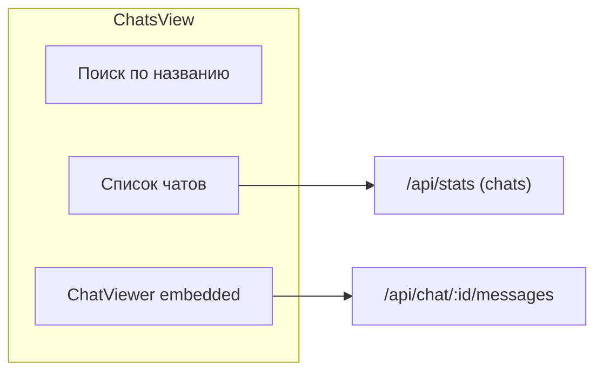

# Вкладка «Чаты» в веб-дашборде

## Цель

Новая вкладка «Чаты» в навигации (Прогресс | Логи | Файлы | **Чаты**) с удобным просмотром чатов: поиск по списку чатов и полнофункциональный просмотр сообщений выбранного чата (с поиском, хэштегами, медиа).

## Архитектура




## Файлы для изменения

- [web/ui/src/App.jsx](web/ui/src/App.jsx) — основной контейнер, TABS, ChatsView, рефакторинг ChatViewer
- [web/app.py](web/app.py) — опционально: расширение API для серверного поиска по сообщениям
- [utils/clickhouse_db.py](utils/clickhouse_db.py) — опционально: `get_messages_page(..., q=...)` для поиска

## План реализации

### 1. Git-ветка

Создать ветку `feature/chats-tab` от `master`.

### 2. Рефакторинг ChatViewer для embedded-режима

ChatViewer сейчас рендерится в modal overlay (`fixed inset-0`, `createPortal`). Нужен режим без модального окна — встроенный в layout.

Варианты:

- Добавить проп `embedded?: boolean`: при `embedded` — без `fixed`, без backdrop, без кнопки «назад» (или минимальная шапка).
- Либо вынести содержимое в `ChatViewerContent` и использовать его в обоих режимах.

Рекомендуемый подход: проп `embedded` + условный рендер:

- `embedded=false` (по умолчанию): текущий overlay-вариант (для прогресса).
- `embedded=true`: контент в `div` с `flex-1 min-h-0` (без fixed/backdrop).

### 3. Компонент ChatsView

Структура (split layout, responsive):

```
+------------------------------------------+
| [Поиск по названию чата...] [Обновить]   |
+------------------+-----------------------+
| Список чатов     | ChatViewer            |
| - Чат 1          | (сообщения, поиск,    |
| - Чат 2          |  медиа, хэштеги)      |
| - ...            |                       |
|                  | или placeholder:      |
|                  | "Выберите чат"        |
+------------------+-----------------------+
```

- Левая панель (~280px, `min-w-[200px]`): поиск + `stats.chats`, фильтрация по `query` (client-side).
- Правая панель: если выбран чат — `ChatViewer embedded={true}`, иначе placeholder.
- На мобильных: вертикальный stack (сверху список, снизу просмотр).

Логика:

- `useState` для `selectedChatId` и `searchQuery`.
- Список чатов из `stats?.chats` (тот же источник, что и на Прогресс).
- Debounce для поиска, как в LogsView.
- Передавать в ChatViewer: `chatId`, `title`, `chats`, `onOpenChat`, `embedded=true`, без `onClose` в embedded (или кнопка «очистить выбор»).

### 4. Интеграция в Dashboard

- Добавить в `TABS`: `{ id: "chats", label: "Чаты", icon: MessageCircle }` (импорт из lucide-react).
- Добавить рендер: `{activeTab === "chats" && <ChatsView enabled={stats?.enabled && stats?.connected} chatList={stats?.chats || []} />}`.
- Условие `showProgressContent` оставить без изменений — вкладка Чаты не зависит от `selectedChat`.

### 5. Серверный поиск по сообщениям (опционально)

Сейчас поиск в ChatViewer — только по уже загруженным сообщениям. Для полноценного поиска по аналогии с Logs:

- API: `GET /api/chat/{chat_id}/messages?q=...&offset=...&limit=...`.
- ClickHouse: `get_messages_page(chat_id, offset, limit, q=...)` с `WHERE ... AND (positionCaseInsensitive(text, %(q)s) > 0)`.
- Во frontend: при вводе `q` вызывать API с `q`, обновлять `items`/`total` и показывать пагинированные результаты.

Можно сделать в два этапа: сначала вкладка без серверного поиска (как есть client-side в ChatViewer), затем добавить API.

## Зависимости

- ClickHouse должен быть включён (как для Логов и Файлов).
- Используется существующий `stats.chats` и `/api/chat/{id}/messages`.

## Риски и ограничения

- Один `ChatViewer` на странице — при переключении чата состояние сбрасывается (Virtuoso, `searchQuery` и т.д.), что нормально.
- Если `stats.chats` пуст (нет загруженных чатов) — показать заглушку «Нет чатов в архиве».

