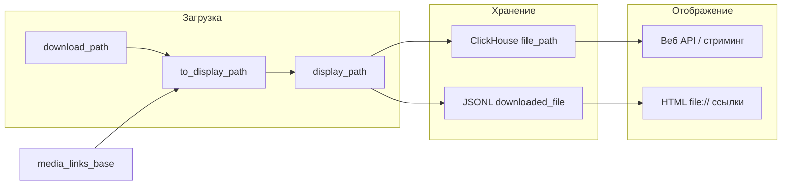

# Обновление ссылок на скачанные файлы на папку из конфигурации

## Контекст

- **Где хранятся пути сейчас:** поле `downloaded_file` в JSONL/JSON истории; колонка `file_path` в ClickHouse (таблицы `messages`, `file_downloads`); в HTML генерируются `file://` ссылки из этих же путей ([utils/html_formatter.py](utils/html_formatter.py) 54–58).
- **Откуда берутся пути:** при сохранении после загрузки в [core/downloader.py](core/downloader.py) в CH передаётся `download_path` (1017–1024), в history — `downloaded_files` (1356–1368); при потоковой отдаче в веб-приложении путь читается из CH и проверяется через `_path_under_base(file_path, base_dir)` ([web/app.py](web/app.py) 732–734).

## Идея фичи

- В конфиг добавить опциональный параметр `**media_links_base`** (в `download_settings`). Если задан — все **сохраняемые** и **отображаемые** пути к файлам записываются не как фактические пути загрузки (`base_directory`), а как пути относительно этой новой папки (тот же относительный путь под `media_links_base`). Файлы по-прежнему качаются в `base_directory`; в истории/CH/HTML и в веб-API будут ссылки на новую папку (подразумевается, что пользователь сам переносит/копирует туда медиа или монтирует диск по этому пути).
- Для **уже существующих** данных — отдельный скрипт, который перезаписывает префикс путей (с `base_directory` на `media_links_base`) в JSONL и в ClickHouse, с опцией пересборки HTML.

## Изменения по файлам

### 1. Схема конфигурации и загрузка

- **[utils/config_schema.py](utils/config_schema.py)**
В `DownloadSettings` добавить поле, например:
  - `media_links_base: str = ""`
  Описание: если не пусто, в историю и ClickHouse записываются пути к файлам относительно этой папки (тот же относительный путь от `base_directory` подменяется на `media_links_base`). Пусто = как сейчас, везде фактические пути.

### 2. Утилита преобразования пути

- **Новый модуль (например, [utils/path_rewrite.py](utils/path_rewrite.py))**
Функция вида:
  - `to_display_path(real_path: str, base_directory: str, media_links_base: str) -> str`
  Если `media_links_base` пустой — возвращать `real_path`. Иначе: если `real_path` под `base_directory` (нормализованные абсолютные пути), заменить префикс на `media_links_base` (сохраняя относительный хвост), иначе вернуть `real_path`.
  Учесть относительные пути (разрешать относительно `base_directory` перед сравнением).
  Использовать `os.path.normpath` / `os.path.commonpath` для кросс-платформы (в т.ч. Windows).

### 3. Запись путей при загрузке

- **[core/downloader.py](core/downloader.py)**
  - При сохранении в ClickHouse: перед вызовами `save_file_download` (около 1017) и при формировании `msg_data["file_path"]` для `save_message` (около 1331) подставлять «display path» через `to_display_path(real_path, base_dir, media_links_base)` из конфига.
  - Перед вызовом `history_manager.save_batch(..., downloaded_files)` (1356–1368): в словаре `downloaded_files` подменять значения на display path для тех же ключей.
  Таким образом, в CH и в истории сразу пишутся ссылки на новую папку.

### 4. Веб-приложение

- **[web/app.py](web/app.py)**
  - В `_get_base_directory()` (или в новой хелпере) при наличии непустого `media_links_base` возвращать для проверки путей и «ожидаемого корня» именно `media_links_base` (абсолютный), чтобы `_path_under_base` и фактическое чтение файла по пути из CH соответствовали новой папке.
  То есть: «effective base» = `media_links_base` если задан, иначе `base_directory`.

### 5. Скрипт перезаписи существующих ссылок

- **Новый скрипт (например, [rewrite_media_links.py](rewrite_media_links.py))**
  - Читает из конфига `base_directory`, `media_links_base`, `history_directory`, настройки ClickHouse.
  - **JSONL:** для каждого `history/chat_*.jsonl` построчно читать, в поле `downloaded_file` заменять префикс `base_directory` → `media_links_base` (нормализованные пути), перезаписывать файл (или во временный, затем rename).
  - **ClickHouse:** один или два UPDATE (или ALTER + перезаливка, в зависимости от принятой схемы в проекте): обновить `file_path` в `messages` и в `file_downloads` по тому же правилу замены префикса (только для строк, где путь начинается с base_directory).
  - Флаг `--regenerate-html`: после перезаписи вызвать логику пересборки HTML (как в [rebuild_history_index.py](rebuild_history_index.py) с `--regenerate-html`), чтобы все `file://` в chat_*.html соответствовали новым путям.

### 6. Документация и пример конфига

- **[config.yaml.example](config.yaml.example)**
В `download_settings` добавить закомментированный пример:
  - `# media_links_base: ""  # Если задан, ссылки в истории и HTML указывают сюда (например, после переноса медиа)`.
- **README или HISTORY_VIEWER_GUIDE:** коротко описать сценарий «файлы перенесены в другую папку» и использование `media_links_base` + скрипта перезаписи.

### 7. Обработка краевых случаев

- Пути вне `base_directory` (например, из `archive_settings.extraction_directory`): не подменять — возвращать как есть в `to_display_path`.
- Пустой `media_links_base`: поведение как сейчас, без подмены.
- Скрипт перезаписи: сухой прогон `--dry-run` (вывод того, что будет заменено, без записи).

## Порядок внедрения

1. Добавить `media_links_base` в схему и пример конфига.
2. Реализовать `utils/path_rewrite.py` с `to_display_path`.
3. В downloader при записи в CH и в history использовать `to_display_path`.
4. В веб-приложении использовать effective base (media_links_base или base_directory) для проверки путей.
5. Добавить скрипт `rewrite_media_links.py` (JSONL + CH + опция пересборки HTML).
6. Тесты: unit для `to_display_path`; при необходимости — интеграционный тест (сохранение сообщения с `media_links_base` и проверка записанного пути).

## Диаграмма потока (при заданном media_links_base)

## Ветка

Работу вести в отдельной ветке (например, `feature/media-links-base`), коммиты и сообщения — на русском.