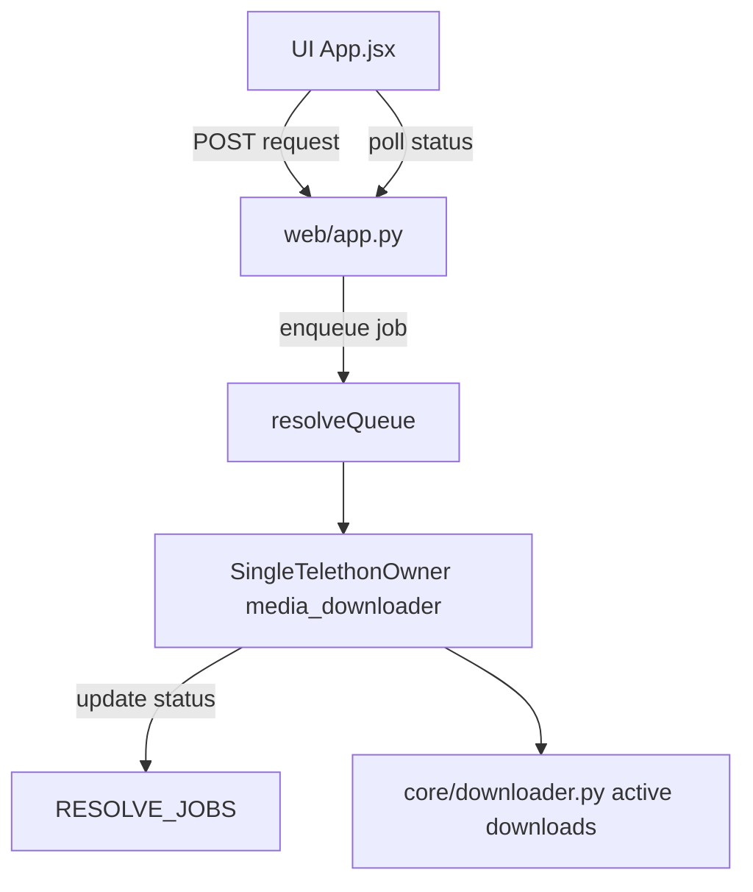

# План ускорения резолвера без отдельной авторизации

## Цель

Снизить задержки resolver-задач и убрать конфликты SQLite (`database is locked`) без отдельной сессии/логина, используя только текущую рабочую сессию `media_downloader`.

## Рекомендованная архитектура

- Один владелец Telethon-клиента (`media_downloader`) в runtime загрузчика.
- Web-слой не создает свои `TelegramClient`, а отправляет задачи в внутреннюю очередь и читает статус job.
- Резолвер выполняет задачи в «safe windows» между активными скачиваниями (или с низким бюджетом времени), без блокировки загрузок.

## Этап 1: Быстрый выигрыш (минимальный риск)

- В [web/app.py](/home/artem/projects/python/telegram_media_downloader/web/app.py):
  - убрать создание `TelegramClient` в каждом `task_type` и перейти к переиспользованию одного клиента в worker (без `connect/disconnect` на каждую задачу);
  - оставить текущую сессию `media_downloader`;
  - добавить ограниченный backoff + retry budget на `database is locked` (чтобы не крутить бесконечные requeue);
  - ограничить размер `_RESOLVER_QUEUE` и ввести TTL/очистку для завершенных jobs и `_PROFILE_PHOTO_JOB_DATA`.
- В [web/ui/src/App.jsx](/home/artem/projects/python/telegram_media_downloader/web/ui/src/App.jsx):
  - убрать стартовые задержки polling (первый запрос сразу);
  - сделать адаптивный интервал polling (быстрее в начале, медленнее потом).

## Этап 2: Устранение корня блокировок (целевая модель)

- В [core/downloader.py](/home/artem/projects/python/telegram_media_downloader/core/downloader.py) и/или [core/session.py](/home/artem/projects/python/telegram_media_downloader/core/session.py):
  - добавить «resolver gateway» поверх уже открытого клиента downloader;
  - реализовать обработку задач резолва через общий async-канал (один event loop, один клиент).
- В [web/app.py](/home/artem/projects/python/telegram_media_downloader/web/app.py):
  - заменить прямые Telethon-вызовы на IPC/очередь к gateway;
  - оставить API job-модель (`request -> job_id -> status`).

## Этап 3: Стабилизация UX и наблюдаемость

- В [web/ui/src/App.jsx](/home/artem/projects/python/telegram_media_downloader/web/ui/src/App.jsx):
  - унифицировать обработку ошибок jobs (`username not found`, timeout, busy) и показать понятные статусы.
- В [web/app.py](/home/artem/projects/python/telegram_media_downloader/web/app.py):
  - добавить метрики: время выполнения по task_type, число retries, глубина очереди, доля ошибок.
- В [CHANGELOG.md](/home/artem/projects/python/telegram_media_downloader/CHANGELOG.md):
  - зафиксировать изменение модели резолвера.

## Проверка после внедрения

- Нагрузка: активная загрузка файлов + массовые клики по t.me ссылкам.
- Критерии:
  - нет `database is locked` в steady-state;
  - нет требований отдельной авторизации;
  - медиана времени `username -> chat_id` заметно ниже (целевой ориентир: <1-2с при свободном канале);
  - загрузка файлов не подвисает при открытии профиля/резолве ссылок.

