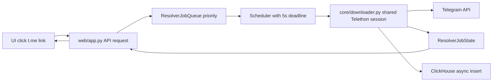

# План ускорения резолвера и ClickHouse

## Цели

- SLA: `<= 5 сек` для `username/chat_id/full_profile/profile_photo` при полной загрузке скачиваний.
- Без отдельной авторизации: использовать только текущую рабочую сессию `media_downloader`.
- Убрать пакетную запись во всех вставках и перевести вставки на быстрый async insert ClickHouse.

## Ветка фичи

- Создать ветку: `feature/resolver-5s-async-clickhouse`.

## Архитектурное решение

## Шаг 1: Резолвер на общей сессии + SLA scheduler

- Файл: [/home/artem/projects/python/telegram_media_downloader/web/app.py](/home/artem/projects/python/telegram_media_downloader/web/app.py)
- Файл: [/home/artem/projects/python/telegram_media_downloader/core/downloader.py](/home/artem/projects/python/telegram_media_downloader/core/downloader.py)
- Что сделать:
  - Убрать создание `TelegramClient` на каждую resolver-задачу в веб-воркере.
  - Использовать один канал выполнения через текущую рабочую сессию `media_downloader` (через интеграцию с downloader task-loop).
  - Ввести priority/deadline очередь (`urgent` для username/chat_id, `normal` для full_profile/photo), но с глобальным дедлайном 5 сек для всех.
  - Вместо `sleep/requeue` по `active_downloads` — time-sliced scheduler (квота времени на resolver в каждом цикле загрузчика).
  - При `database is locked` — bounded retry с jitter + дедлайн-защита (чтобы не уходить в бесконечный requeue).

## Шаг 2: Неблокирующий API-контракт резолвера

- Файл: [/home/artem/projects/python/telegram_media_downloader/web/app.py](/home/artem/projects/python/telegram_media_downloader/web/app.py)
- Файл: [/home/artem/projects/python/telegram_media_downloader/web/ui/src/App.jsx](/home/artem/projects/python/telegram_media_downloader/web/ui/src/App.jsx)
- Что сделать:
  - Единый job API: `request -> job_id -> status polling` для всех типов задач.
  - В `status` вернуть прогресс/стадию (`queued`, `running`, `retrying`, `done`, `error`, `deadline_exceeded`).
  - На фронте polling без ложного timeout, но с UI-статусом дедлайна 5 сек.

## Шаг 3: Убрать пакетные вставки во всех таблицах

- Файл: [/home/artem/projects/python/telegram_media_downloader/utils/clickhouse_db.py](/home/artem/projects/python/telegram_media_downloader/utils/clickhouse_db.py)
- Файл: [/home/artem/projects/python/telegram_media_downloader/core/downloader.py](/home/artem/projects/python/telegram_media_downloader/core/downloader.py)
- Что сделать:
  - Убрать буферизацию/пакетные flush-механики для `messages/chats/file_downloads/logs`.
  - Перевести каждую вставку на `INSERT ... SETTINGS async_insert=1`.
  - Настройки по умолчанию:
    - для высокочастотных вставок (`messages`, `file_downloads`, `logs`): `wait_for_async_insert=0`;
    - для критичных метаданных (`chats`): `wait_for_async_insert=1`.
  - Добавить централизованный helper вставки с per-table settings и backpressure (ограничение частоты insert при перегрузке).

## Шаг 4: Тюнинг ClickHouse под low-latency insert

- Файл: [/home/artem/projects/python/telegram_media_downloader/config.yaml.example](/home/artem/projects/python/telegram_media_downloader/config.yaml.example)
- Файл: [/home/artem/projects/python/telegram_media_downloader/config.yaml](/home/artem/projects/python/telegram_media_downloader/config.yaml)
- Что сделать:
  - Добавить/документировать блок `clickhouse.insert_settings`:
    - `async_insert`, `wait_for_async_insert`, `async_insert_busy_timeout_ms`, `async_insert_stale_timeout_ms`, `max_insert_threads`.
  - Поддержать override per-table.
  - Добавить безопасные дефолты для production и отдельные fast-дефолты для resolver-path.

## Шаг 5: Метрики и проверка SLA

- Файл: [/home/artem/projects/python/telegram_media_downloader/web/app.py](/home/artem/projects/python/telegram_media_downloader/web/app.py)
- Файл: [/home/artem/projects/python/telegram_media_downloader/core/downloader.py](/home/artem/projects/python/telegram_media_downloader/core/downloader.py)
- Что сделать:
  - Метрики: `resolver_queue_depth`, `resolver_task_latency_ms`, `resolver_deadline_miss`, `sqlite_lock_retries`, `ch_insert_latency_ms`.
  - Нагрузочный прогон: при максимальном `max_parallel_downloads` проверить p95/p99 по всем resolver-задачам.
  - Критерий приёмки: p95 <= 5 сек для `username/chat_id/full_profile/profile_photo`.

## Шаг 6: Документация и changelog

- Файл: [/home/artem/projects/python/telegram_media_downloader/docs/RESOLVER_SESSION.md](/home/artem/projects/python/telegram_media_downloader/docs/RESOLVER_SESSION.md)
- Файл: [/home/artem/projects/python/telegram_media_downloader/CHANGELOG.md](/home/artem/projects/python/telegram_media_downloader/CHANGELOG.md)
- Что сделать:
  - Обновить описание: единая сессия, без отдельной авторизации.
  - Описать async insert режим и параметры тюнинга.
  - Зафиксировать SLA и ограничения.

