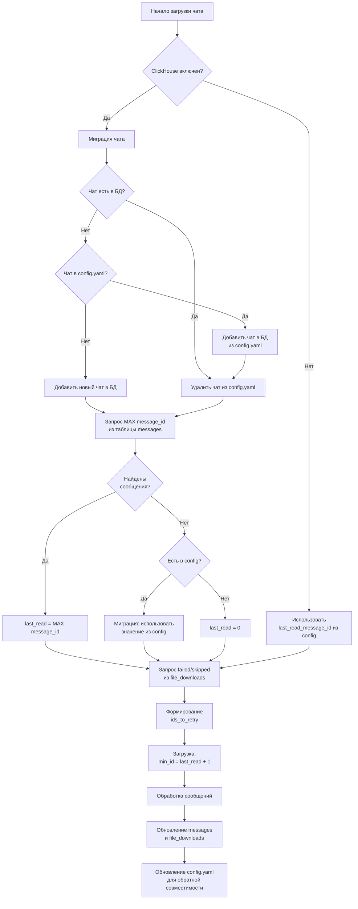

# Фикс загрузки и проверки дублей

## Проблема

При перезапуске приложения происходит проверка с первого сообщения чата, даже если есть счетчик последнего скачанного сообщения. Это приводит к:

- Ненужным проверкам существующих файлов
- Логированию "Файл уже существует и валиден..." для тысяч старых сообщений
- Потере производительности

**Причина:** `last_read_message_id` в `config.yaml` может сбрасываться (например, при `history_rebuild_if_missing`) или быть некорректным.

## Решение

Хранить состояние загрузки в ClickHouse вместо `config.yaml`:

1. При старте загрузки чата запрашивать максимальный `message_id` из таблицы `messages` для этого чата
2. Использовать этот `message_id` как `last_read_message_id`
3. Для `ids_to_retry` использовать таблицу `file_downloads` со статусами `failed`/`skipped`
4. Поля в `config.yaml` пометить устаревшими, но использовать для миграции при первом запуске
5. **Миграция чатов**: при обнаружении чата в `config.yaml`:
  - Если чата нет в таблице `chats` БД - добавить его
  - Если чат есть в БД - удалить его из `config.yaml` (избыточность)

## Архитектура




## Изменения

### 1. Добавить методы в `[utils/clickhouse_db.py](utils/clickhouse_db.py)`

Добавить метод `chat_exists`:

```python
def chat_exists(self, chat_id: int) -> bool:
    """Проверить существование чата в таблице chats.

    Parameters
    ----------
    chat_id : int
        ID чата

    Returns
    -------
    bool
        True, если чат существует в БД
    """
    if not self.enabled:
        return False
    try:
        client = self._get_client()
        rows = client.execute(
            "SELECT 1 FROM chats WHERE chat_id = %(chat_id)s LIMIT 1",
            {"chat_id": chat_id},
        )
        return len(rows) > 0
    except Exception as e:
        logger.warning("Ошибка проверки существования чата %s: %s", chat_id, e)
        return False
```

Добавить метод `ensure_chat_in_db`:

```python
def ensure_chat_in_db(self, chat_id: int, title: str = "") -> None:
    """Добавить чат в таблицу chats, если его там нет.

    Parameters
    ----------
    chat_id : int
        ID чата
    title : str
        Название чата (опционально)
    """
    if not self.enabled:
        return
    try:
        client = self._get_client()
        # INSERT с ON CONFLICT для идемпотентности
        client.execute(
            """
            INSERT INTO chats (chat_id, title, last_sync, message_count, total_size)
            VALUES (%(chat_id)s, %(title)s, now(), 0, 0)
            """,
            {"chat_id": chat_id, "title": title or f"Chat {chat_id}"},
        )
        logger.info("Чат %s добавлен в БД", chat_id)
    except Exception as e:
        # ReplacingMergeTree может вызвать конфликт при параллельной вставке
        logger.debug("Чат %s уже существует в БД или ошибка вставки: %s", chat_id, e)
```

Добавить метод `get_last_processed_message_id`:

```python
def get_last_processed_message_id(self, chat_id: int) -> Optional[int]:
    """Получить максимальный message_id для чата из БД.

    Parameters
    ----------
    chat_id : int
        ID чата

    Returns
    -------
    Optional[int]
        Максимальный message_id или None, если сообщений нет
    """
    if not self.enabled:
        return None
    try:
        client = self._get_client()
        rows = client.execute(
            "SELECT max(message_id) FROM messages WHERE chat_id = %(chat_id)s",
            {"chat_id": chat_id},
        )
        if rows and rows[0][0] is not None:
            return int(rows[0][0])
        return None
    except Exception as e:
        logger.warning("Ошибка получения последнего message_id для чата %s: %s", chat_id, e)
        return None
```

Добавить метод `get_retry_message_ids`:

```python
def get_retry_message_ids(self, chat_id: int, limit: int = 1000) -> List[int]:
    """Получить список message_id для повторной загрузки из file_downloads.

    Parameters
    ----------
    chat_id : int
        ID чата
    limit : int
        Максимальное количество записей (по умолчанию 1000)

    Returns
    -------
    List[int]
        Список message_id со статусом failed или skipped
    """
    if not self.enabled:
        return []
    try:
        client = self._get_client()
        rows = client.execute(
            """
            SELECT message_id
            FROM file_downloads
            WHERE chat_id = %(chat_id)s
              AND status IN ('failed', 'skipped')
            ORDER BY created_at DESC
            LIMIT %(limit)s
            """,
            {"chat_id": chat_id, "limit": limit},
        )
        return [int(row[0]) for row in rows]
    except Exception as e:
        logger.warning("Ошибка получения списка retry для чата %s: %s", chat_id, e)
        return []
```

### 2. Добавить метод миграции чата в `[core/downloader.py](core/downloader.py)`

Добавить метод `_migrate_chat_to_db`:

```python
def _migrate_chat_to_db(self, chat_id: int, chat_title: str = "") -> None:
    """Мигрировать чат из config.yaml в ClickHouse.

    Parameters
    ----------
    chat_id : int
        ID чата
    chat_title : str
        Название чата (опционально)
    """
    if not self.clickhouse_db or not self.clickhouse_db.enabled:
        return

    # Проверить, есть ли чат в БД
    if self.clickhouse_db.chat_exists(chat_id):
        # Чат есть в БД - удалить из config.yaml
        if "chats" in self.config and isinstance(self.config["chats"], list):
            original_count = len(self.config["chats"])
            self.config["chats"] = [
                c for c in self.config["chats"]
                if c.get("chat_id") != chat_id
            ]
            if len(self.config["chats"]) < original_count:
                self.config_manager.save()
                logger.info(
                    "Чат %s удален из config.yaml (уже есть в БД)",
                    chat_id,
                )
    else:
        # Чата нет в БД - добавить
        # Попытаться взять title из config.yaml
        config_title = chat_title
        if "chats" in self.config and isinstance(self.config["chats"], list):
            chat_config = next(
                (c for c in self.config["chats"] if c.get("chat_id") == chat_id),
                None
            )
            if chat_config and chat_config.get("title"):
                config_title = chat_config["title"]

        self.clickhouse_db.ensure_chat_in_db(chat_id, config_title)

        # После добавления в БД - удалить из config.yaml
        if "chats" in self.config and isinstance(self.config["chats"], list):
            original_count = len(self.config["chats"])
            self.config["chats"] = [
                c for c in self.config["chats"]
                if c.get("chat_id") != chat_id
            ]
            if len(self.config["chats"]) < original_count:
                self.config_manager.save()
                logger.info(
                    "Чат %s мигрирован в БД и удален из config.yaml",
                    chat_id,
                )
```

### 3. Обновить логику в `begin_import_chat`

В методе `begin_import_chat` (строки 1482-1500) заменить логику получения `last_read_message_id`:

**Текущий код:**

```python
# Получить last_read_message_id для этого чата
if "chats" in self.config and isinstance(self.config["chats"], list):
    chat_config = next(
        (c for c in self.config["chats"] if c.get("chat_id") == chat_id), None
    )
    if chat_config:
        last_read_message_id = chat_config.get("last_read_message_id", 0)
        ids_to_retry = chat_config.get("ids_to_retry", [])
    else:
        last_read_message_id = 0
        ids_to_retry = []
else:
    # Старая структура - использовать общий chat_id
    if self.config.get("chat_id") == chat_id:
        last_read_message_id = self.config.get("last_read_message_id", 0)
        ids_to_retry = self.config.get("ids_to_retry", [])
    else:
        last_read_message_id = 0
        ids_to_retry = []
```

**Новый код:**

```python
# Получить last_read_message_id из ClickHouse (приоритет) или config.yaml (fallback/миграция)
last_read_message_id = 0
ids_to_retry = []

if self.clickhouse_db and self.clickhouse_db.enabled:
    # МИГРАЦИЯ: добавить чат в БД, если его там нет, или удалить из config, если есть
    chat_title = self.config.get("chat_title", "")
    self._migrate_chat_to_db(chat_id, chat_title)

    # Приоритет: запросить из БД
    db_last_id = self.clickhouse_db.get_last_processed_message_id(chat_id)
    if db_last_id is not None:
        last_read_message_id = db_last_id
        logger.info(
            "Продолжение загрузки чата %s с message_id=%s (из БД)",
            chat_id,
            last_read_message_id,
        )
    else:
        # Нет данных в БД - попытка миграции из config.yaml
        config_last_id, config_retry = self._get_chat_state_from_config(chat_id)
        if config_last_id > 0:
            last_read_message_id = config_last_id
            logger.info(
                "Миграция: использование last_read_message_id=%s из config.yaml для чата %s",
                last_read_message_id,
                chat_id,
            )

    # Получить ids_to_retry из file_downloads
    max_retry = self.config.get("download_settings", {}).get("max_ids_to_retry", 500)
    ids_to_retry = self.clickhouse_db.get_retry_message_ids(chat_id, limit=max_retry)
    if ids_to_retry:
        logger.info(
            "Запланировано %s сообщений для повторной загрузки (из БД)",
            len(ids_to_retry),
        )
else:
    # Fallback: использовать config.yaml
    last_read_message_id, ids_to_retry = self._get_chat_state_from_config(chat_id)
    if last_read_message_id > 0:
        logger.info(
            "Продолжение загрузки чата %s с message_id=%s (из config.yaml, ClickHouse отключен)",
            chat_id,
            last_read_message_id,
        )
```

Добавить вспомогательный метод `_get_chat_state_from_config`:

```python
def _get_chat_state_from_config(self, chat_id: int) -> Tuple[int, List[int]]:
    """Получить last_read_message_id и ids_to_retry из config.yaml.

    Parameters
    ----------
    chat_id : int
        ID чата

    Returns
    -------
    Tuple[int, List[int]]
        (last_read_message_id, ids_to_retry)
    """
    last_read_message_id = 0
    ids_to_retry = []

    if "chats" in self.config and isinstance(self.config["chats"], list):
        chat_config = next(
            (c for c in self.config["chats"] if c.get("chat_id") == chat_id), None
        )
        if chat_config:
            last_read_message_id = chat_config.get("last_read_message_id", 0)
            ids_to_retry = chat_config.get("ids_to_retry", [])
    else:
        # Старая структура - использовать общий chat_id
        if self.config.get("chat_id") == chat_id:
            last_read_message_id = self.config.get("last_read_message_id", 0)
            ids_to_retry = self.config.get("ids_to_retry", [])

    return last_read_message_id, ids_to_retry
```

### 4. Обновить документацию в `[config.yaml.example](config.yaml.example)`

В секции `chats` добавить комментарий о том, что поля `last_read_message_id` и `ids_to_retry` устарели:

```yaml
chats:
  - chat_id: 123456789
    title: "Название чата"
    # УСТАРЕЛО: last_read_message_id теперь берется из ClickHouse (если включен)
    # Используется только для миграции при первом запуске с ClickHouse
    last_read_message_id: 0
    # УСТАРЕЛО: ids_to_retry теперь берется из таблицы file_downloads (если ClickHouse включен)
    ids_to_retry: []
    enabled: true
    order: 0
```

### 5. Добавить запись в `[CHANGELOG.md](CHANGELOG.md)`

В секцию `[Unreleased] -> ### Changed`:

```markdown
- Переход на хранение состояния загрузки в ClickHouse вместо config.yaml:
  - `last_read_message_id` теперь определяется как максимальный message_id из таблицы messages
  - `ids_to_retry` теперь берется из таблицы file_downloads (статусы failed/skipped)
  - Поля в config.yaml помечены устаревшими, но используются для миграции
  - Исключены проверки старых сообщений при перезапуске приложения
  - Автоматическая миграция чатов: добавление в БД из config.yaml и удаление из конфига после миграции
```

## Преимущества

1. **Производительность**: нет проверки тысяч старых сообщений при перезапуске
2. **Надежность**: состояние загрузки не может быть некорректным из-за сброса в config.yaml
3. **Консистентность**: единый источник истины - ClickHouse
4. **Обратная совместимость**: fallback на config.yaml при отключенном ClickHouse
5. **Миграция**: автоматическое использование значений из config.yaml при первом запуске
6. **Чистота конфигурации**: чаты автоматически удаляются из config.yaml после миграции в БД

## Риски и митигация

- **ClickHouse отключен**: автоматический fallback на config.yaml
- **Миграция старых данных**: автоматическое использование значений из config при первом запуске
- **Производительность запросов**: MAX(message_id) выполняется за O(1) благодаря индексу `ORDER BY (chat_id, date, message_id)`

