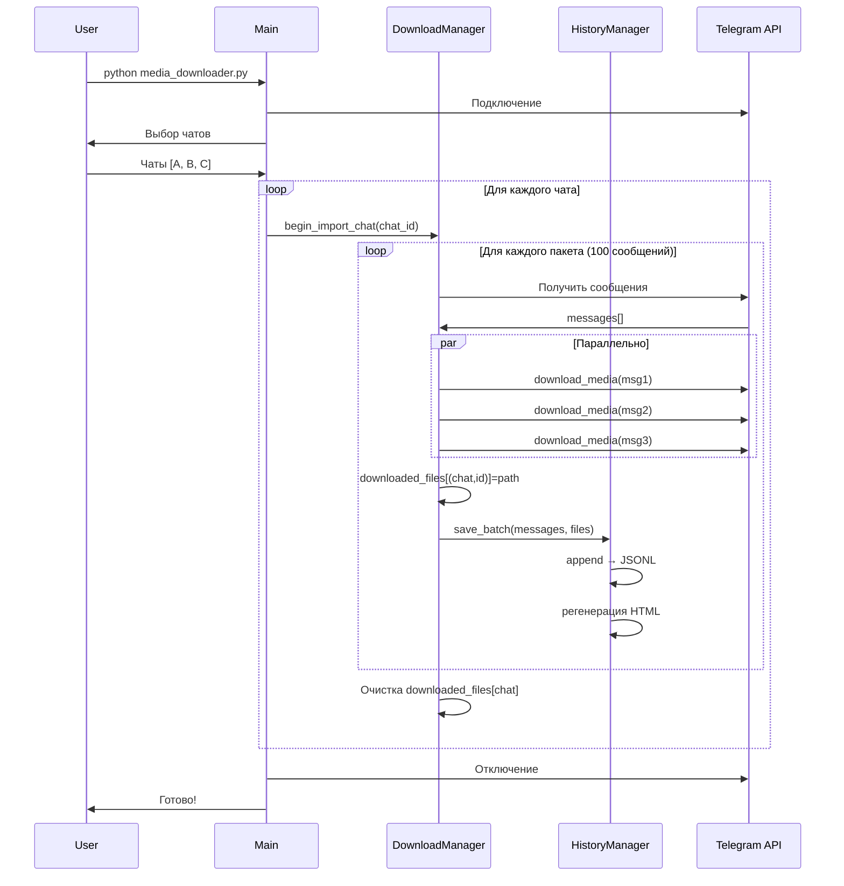

# 🏗️ Архитектура и технические детали

> Полное техническое описание архитектуры Telegram Media Downloader

## Содержание

- [Обзор системы](#обзор-системы)
- [Архитектура истории](#архитектура-истории)
- [Изоляция данных](#изоляция-данных)
- [Управление памятью](#управление-памятью)
- [Производительность](#производительность)
- [Безопасность](#безопасность)

## Обзор системы

Telegram Media Downloader состоит из нескольких взаимосвязанных модулей:

```
┌─────────────────────────────────────────────────────────────┐
│                    СИСТЕМА ЗАГРУЗКИ                          │
├─────────────────────────────────────────────────────────────┤
│                                                              │
│  ┌──────────────┐     ┌──────────────┐     ┌─────────────┐ │
│  │   Telegram   │────▶│  Download    │────▶│   History   │ │
│  │     API      │     │   Manager    │     │   Manager   │ │
│  └──────────────┘     └──────────────┘     └─────────────┘ │
│         │                    │                     │        │
│         │                    │                     │        │
│         ▼                    ▼                     ▼        │
│  ┌──────────────┐     ┌──────────────┐     ┌─────────────┐ │
│  │    Filters   │     │     File     │     │    HTML     │ │
│  │   (sender,   │     │  Management  │     │  Generator  │ │
│  │  date, etc)  │     │  (duplicates)│     │             │ │
│  └──────────────┘     └──────────────┘     └─────────────┘ │
│                                                              │
└─────────────────────────────────────────────────────────────┘
```

## Архитектура истории

### Двухуровневая система

История сообщений использует двухуровневую архитектуру:

1. **JSONL (Источник истины)** - Быстрая запись, накопление
2. **HTML (Презентация)** - Красивое отображение, поиск

#### Уровень 1: JSONL

```python
# chat_-1003334819414.jsonl
{"id": 1, "text": "...", "downloaded_file": "/path/file.jpg"}
{"id": 2, "text": "...", "downloaded_file": null}
{"id": 3, "text": "...", "downloaded_file": "/path/video.mp4"}
```

**Характеристики:**
- Формат: JSON Lines (одна строка = одно сообщение)
- Режим записи: `append` (добавление в конец)
- Скорость: Очень быстро (нет чтения/парсинга)
- Назначение: Накопление данных

#### Уровень 2: HTML

```html
<!-- chat_-1003334819414.html -->
<!DOCTYPE html>
<html>
  <!-- Полный HTML с CSS, JavaScript, всеми сообщениями -->
</html>
```

**Характеристики:**
- Формат: Полный HTML документ
- Режим записи: `overwrite` (полная перезапись)
- Скорость: Медленно (чтение JSONL + генерация)
- Назначение: Красивое отображение

### Алгоритм работы

```
ЗАГРУЗКА ПАКЕТА СООБЩЕНИЙ (100 шт)
═══════════════════════════════════════════════════════════

1. download_media() для каждого сообщения
   ├─ Скачивание файла
   ├─ Управление дубликатами (MD5)
   └─ Сохранение пути: downloaded_files[(chat_id, msg_id)] = path

2. process_messages() для пакета
   ├─ Параллельная обработка с семафором
   └─ Возврат списка message_ids

3. save_batch() - сохранение истории
   │
   ├─ Для каждого сообщения:
   │  └─ save_message()
   │     └─ _save_html_message()
   │        └─ append строку в JSONL файл ✍️
   │
   └─ _generate_index_html()
      │
      ├─ Для каждого чата:
      │  └─ _generate_chat_html()
      │     ├─ Прочитать весь JSONL 📖
      │     ├─ Распарсить JSON строки
      │     ├─ Сгенерировать HTML из шаблона 🎨
      │     └─ Перезаписать .html файл ✅
      │
      └─ Сгенерировать index.html ✅
         └─ Список всех чатов с метаданными
```

### Частота обновлений

```yaml
# config.yaml
download_settings:
  pagination_limit: 100  # HTML обновляется каждые 100 сообщений
```

| Значение | Частота обновления | Риск потери | Скорость |
|----------|-------------------|-------------|----------|
| 50       | Каждые 50 сообщений | Низкий | Медленно |
| 100      | Каждые 100 сообщений | Средний | Оптимально ⭐ |
| 500      | Каждые 500 сообщений | Высокий | Быстро |

## Изоляция данных

### Проблема коллизий message_id

**Ситуация:**
```python
# Message ID уникальны только внутри чата!
Чат A: сообщения с ID 1, 2, 3, ..., 10000
Чат B: сообщения с ID 1, 2, 3, ..., 15000  # Совпадают!
```

**Неправильное решение:**
```python
# ❌ КОЛЛИЗИЯ: ID=1 из чата B перезапишет ID=1 из чата A
downloaded_files[1] = "/path/video_from_chat_A.mp4"
downloaded_files[1] = "/path/photo_from_chat_B.jpg"  # Перезаписал!
```

**Правильное решение:**
```python
# ✅ Используем кортеж (chat_id, message_id)
downloaded_files[(-1001234567890, 1)] = "/path/video_from_chat_A.mp4"
downloaded_files[(-1009876543210, 1)] = "/path/photo_from_chat_B.jpg"
```

### Фильтрация для текущего чата

```python
# При сохранении истории чата
def process_messages(self, messages, ...):
    # ...
    chat_id = messages[0].chat.id
    
    # Создать словарь только для текущего чата
    chat_files = {
        msg_id: path 
        for (cid, msg_id), path in self.downloaded_files.items() 
        if cid == chat_id  # ← Фильтр по chat_id
    }
    
    # Передать в save_batch
    self.history_manager.save_batch(
        messages, chat_id, chat_title, chat_files
    )
```

## Управление памятью

### Проблема накопления данных

При загрузке нескольких чатов словарь `downloaded_files` растёт:

```python
# Загрузка 3 чатов по 10,000 сообщений

После чата A: 10,000 записей  →  ~500 KB
После чата B: 20,000 записей  → ~1.0 MB  # A + B
После чата C: 30,000 записей  → ~1.5 MB  # A + B + C
```

**Проблема:** Линейный рост потребления памяти!

### Решение: Очистка после каждого чата

```python
# media_downloader.py: begin_import_chat()

async def begin_import_chat(self, client, chat_id, ...):
    # ... загрузка всех сообщений чата ...
    
    # Обновить конфиг
    self.update_config(chat_id)
    
    # Очистить downloaded_files для текущего чата
    keys_to_remove = [
        key for key in self.downloaded_files.keys() 
        if key[0] == chat_id
    ]
    for key in keys_to_remove:
        del self.downloaded_files[key]
    
    # Память освобождена! 🧹
```

### Метрики

**Размер одной записи:**
```
key = (chat_id, message_id)  # 2 × int64 = 16 байт
value = "/media/.../file.mp4"  # строка ~50 байт
overhead = dict overhead       # ~20 байт
────────────────────────────────
Итого: ~86 байт на запись
```

**Сравнение потребления:**

| Сценарий | Чатов | Сообщений | Записей | Память |
|----------|-------|-----------|---------|---------|
| Без очистки | 25 | 10,000 | 250,000 | ~30 MB ❌ |
| С очисткой (max) | 25 | 15,000 | 15,000 | ~2 MB ✅ |

**Экономия: 93%** 🎉

## Производительность

### Параллельные загрузки

```python
# Семафор ограничивает количество одновременных загрузок
max_parallel = self.config.get("download_settings", {}).get(
    "max_parallel_downloads", 5
)
semaphore = asyncio.Semaphore(max_parallel)

# Параллельная обработка пакета
async def download_with_semaphore(message):
    async with semaphore:
        return await self.download_media(...)

message_ids = await asyncio.gather(
    *[download_with_semaphore(msg) for msg in messages]
)
```

**Преимущества:**
- Максимальное использование пропускной способности
- Контроль нагрузки на сеть
- Защита от rate limits

### Кеширование MD5 хешей

```python
_hash_cache: Dict[str, str] = {}

def _get_file_hash(file_path: str) -> str:
    if file_path in _hash_cache:
        return _hash_cache[file_path]  # Кешированное значение
    
    with open(file_path, "rb") as f:
        file_hash = md5(f.read()).hexdigest()
    _hash_cache[file_path] = file_hash
    return file_hash
```

**Ускорение:**
- Первый вызов: чтение файла + MD5
- Повторный вызов: мгновенный возврат из кеша

### Оптимизация I/O

**Async I/O с Telethon:**
```python
# Все операции неблокирующие
await client.download_media(message, file=file_name)
await client.get_messages(chat_id, ids=message.id)
```

**Буферизация записи:**
```python
# JSONL: открываем файл один раз на пакет
with open(jsonl_file, "a") as f:
    for message in messages:
        f.write(json.dumps(message_data) + "\n")
```

## Безопасность

### Защита конфигурации

```gitignore
# .gitignore
config.yaml           # Ваши API ключи
*.session            # Telegram сессия
```

**Важно:**
- Никогда не коммитить `config.yaml`
- Использовать `config.yaml.example` как шаблон
- Хранить API ключи в безопасности

### Валидация путей

```python
# Проверка существования файла перед использованием
if not os.path.exists(file_path):
    return file_path

# Создание директорий безопасно
os.makedirs(download_directory, exist_ok=True)
```

### Санитизация имён файлов

```python
def _sanitize_filename(self, filename: str) -> str:
    """Очистка от недопустимых символов для Windows."""
    replacements = {
        ':': '-', '<': '_', '>': '_', '"': "'",
        '/': '_', '\\': '_', '|': '_', '?': '_', '*': '_',
    }
    for char, replacement in replacements.items():
        filename = filename.replace(char, replacement)
    return filename
```

## Диаграммы

### Последовательность загрузки



---

**Документ обновлён:** 2025-01-02  
**Версия архитектуры:** 1.0
